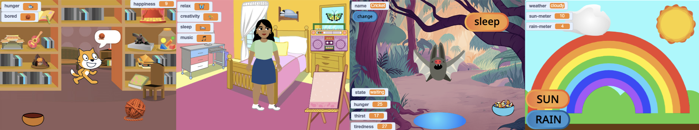

## فكرتك

خطط لحيوانك الأليف الافتراضي أو شخصيتك أو محاكاة الطبيعة. سيتعين على المستخدم تهيئة الظروف المناسبة لدعم احتياجات الكائن الرئيسي. قد يكبر كائنك الرئيسي أو يكتسب الخبرة أو يزيد الصحة أو أي شيء آخر.

يمكنك التخطيط بمجرد التفكير أو الإصلاح أو الرسم أو الكتابة ، أو كيفما تشاء!

عندما يتم تلبية الاحتياجات الأساسية مثل الغذاء والسلامة ، فإننا نخلق الظروف المناسبة للمخلوقات (بما في ذلك أنفسنا) للتعلم والنمو. لذلك في المرة القادمة التي تشعر فيها بالغرابة أو تشتت الانتباه ، تحقق من احتياجاتك الأساسية.  

### لماذا تصنع مشروعك؟

--- task ---

فكر في **الغرض** من مشروعك.

من الممكن أن تكون:
- لتعلم مهارة جديدة ، مثل رعاية حيوان أو إبقاء نبات على قيد الحياة
- لمشاركة رسالة ، مثل الاعتناء بصحتك العقلية أو تحسين صداقتك
- للترفيه عن المستخدمين ، من خلال منحهم شيئًا لن تتاح لهم عادة فرصة التفاعل معه

--- /task ---

### لمن هذا؟

--- task ---

فكر لمن تصمم او تبرمج مشروعك(**جمهورك**).

ستساعدك معرفة جمهورك على تصميم مشروع سيرغبون في تشغيله مرارًا وتكرارًا.

--- /task ---

### البدء

--- task ---

افتح [مشروع Scratch جديد](http://rpf.io/scratch-new){:target="_blank"}. سيتم فتح Scratch في علامة تبويب متصفح أخرى.

--- collapse ---
---
title: العمل دون اتصال
---

[لإعداد Scratch للاستخدام دون اتصال ، تفضل بزيارة دليل Scratch](https://learning-admin.raspberrypi.org/ar-SA/projects/getting-started-scratch/1){:target="_blank"}.

--- /collapse ---

استخدم مشروع سكراتش الجديد أو قلم وورقة أو كليهما لتخطيط أفكارك.

--- /task ---

--- task ---

ماذا سيكون شبحك **الرئيسي**؟
+ شخصية مثل حيوان أليف أو حيوان بري ، أو شخص
+ نبات أو محصول يحتاج إلى ضوء الشمس والماء والعناصر الغذائية
+ ميزة من العلم أو الطبيعة ، مثل قوس قزح أو نار
+ آلة مثل الغواصة أو آلة إعادة التدوير
+ أو شيء آخر

--- /task ---

--- task ---

فكر حول شبحك **الرئيسي** وقرر:

+ ما هي الكائنات و `متغيرات`{:class="block3variables"} قد تكون مطلوبة؟
+ `هل ستتغير `{:class="block3variables"}المتغيرات بمرور الوقت ، على سبيل المثال زيادة الجوع أو التعب كل بضع ثوانٍ؟
+ كيف سيتفاعل المستخدم مع الكائن الرئيسي؟ يمكن أن يكون هذا النقر على الطعام لإطعام حيوان ، أو الدردشة مع شخصية لتقليل الملل.

--- /task ---

--- task ---

امنح مشروعك عنوانًا يخبر المستخدم بما يتوقعه ، ويجعله يرغب في تجربته.

أمثلة المشاريع هي: **محاكاة الخفافيش**، **عمل قوس قزح**، **مزارع البطيخ**، و **آلة الموسيقى**.

يمكنك دائمًا تحديث العنوان لاحقًا إذا كنت تفكر في عنوان أفضل.

--- /task ---

--- save ---
