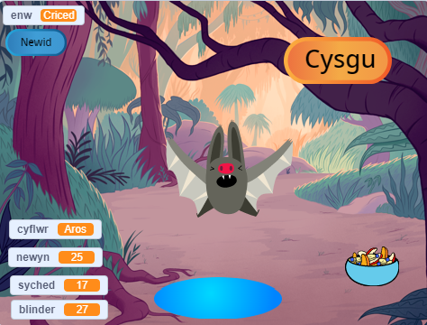
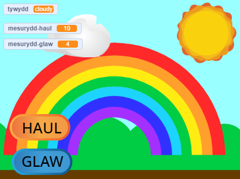

## Byddi di'n creu

Creu anifail anwes rhithwir, cymeriad, neu efelychiad o fyd natur y gall y defnyddiwr ryngweithio ag ef i'w helpu. Bydd angen i dy gêm fodloni **briff y prosiect**.

Mae gemau anifeiliaid anwes rhithwir yn un math o gêm lle mae defnyddwyr yn rhyngweithio â chymeriadau i ddiwallu eu hanghenion. Efallai dy fod ti wedi chwarae gyda Tamagotchi neu wedi mwynhau gemau fel Catz ac Adopt me! ar gyfrifiadur. Alli di feddwl am unrhyw gemau anifeiliaid anwes rhithwir eraill?

Byddi di'n:
+ Creu cymeriad neu efelychiad sy'n hwyl neu'n ddiddorol i chwarae â nhw
+ Defnyddio unrhyw gyfuniad o flociau `newidyn`{:class="block3variables"}, `darlledu`{:class="block3events"}, ac `os`{:class="block3control"}, ynghyd â'r sgiliau rwyt ti wedi'u dysgu eisoes, i alluogi defnyddiwr i ddiwallu anghenion cymeriad
+ Deall sut mae cymeriadau mewn gemau ac apiau yn cael eu rheoli gan algorithmau

--- no-print --- --- task ---

### Chwarae ▶️ 

Rhyngweithia gyda Criced yr ystlum. Beth sy'n digwydd os wyt ti'n clicio ar y corluniau bwyd neu ddŵr? Sut alli di ddweud os ydy'r ystlum yn newynog neu'n sychedig?

**Efelychydd ystlumod**: [Gweld tu mewn](https://scratch.mit.edu/projects/814276834/editor){:target="_blank"}

  <iframe allowtransparency="true" width="485" height="402" src="https://scratch.mit.edu/projects/embed/530008968/?autostart=false" frameborder="0"></iframe>

--- /task ---

--- /no-print ---

### BRIFF Y PROSIECT: Helpwch fi i dyfu

Mae angen creu anifail anwes rhithwir, planhigyn neu efelychiad arall y gall y defnyddiwr ryngweithio ag ef i ddiwallu ei anghenion. Byddi di'n defnyddio **newidynnau** i gadw golwg ar berfformiad dy brif gorlun. Gall fod yn hapus, yn ddiflas, yn sychedig neu'n gysglyd. 

Dylai dy efelychiad:
+ Ddefnyddio o leiaf un `newidyn`{:class="block3variables"} i gadw golwg ar yr hyn sydd ei angen ar y prif gorlun
+ Cael ffordd i'r newidyn(au) newid yn awtomatig
+ Cynnig ffordd i'r defnyddiwr wella'r newidynnau er mwyn rhoi'r hyn sydd ei angen i'r prif gorlun
+ Defnyddio blociau `os`{:class="block3control"} i reoli pryd mae pethau'n digwydd
+ Defnyddio blociau `darlledu`{:class="block3events"} i gyfathrebu rhwng corlunau eraill a'r prif corlun

Gallai eich efelychiad:
+ Gael neges, megis pwysigrwydd bod yn garedig neu gadw cnydau'n iach
+ Rhybuddio'r defnyddiwr pan fydd lefelau'n rhy uchel neu'n isel
+ Caniatáu i'r defnyddiwr sgwrsio â'i gorlun, neu newid ei enw

--- no-print ---

### Cael ysbrydoliaeth 💭

--- task ---

⭐ Rhannwch eich prosiect “Llygaid gwirion” am gyfle i’w gynnwys yma.

Ystyria beth fyddi di'n ei ddewis fel prif gorlun. Gallai fod yn anifail anwes mae'r defnyddiwr yn gofalu amdano, yn berson mae'r defnyddiwr yn ei helpu i wneud penderfyniadau da, yn blanhigyn neu gnwd mae'r defnyddiwr yn helpu i'w dyfu, neu'n wrthrych natur neu ffantasi y mae angen i'r defnyddiwr greu'r amodau cywir ar ei gyfer.

**Creu enfys**: [Gweld tu mewn](https://scratch.mit.edu/projects/814282260/editor){:target="_blank"}

  <iframe allowtransparency="true" width="485" height="402" src="https://scratch.mit.edu/projects/embed/530034441/?autostart=false" frameborder="0"></iframe>

**Ffermwr melonau dŵr**: [Gweld tu mewn](https://scratch.mit.edu/projects/814286289/editor){:target="_blank"}

  <iframe allowtransparency="true" width="485" height="402" src="https://scratch.mit.edu/projects/embed/531858794/?autostart=false" frameborder="0"></iframe>

**⭐ Dolly y ddoll**: [Gweld tu mewn](https://scratch.mit.edu/projects/799871118/editor){:target="_blank"} (prosiect cymunedol dan sylw)

  <iframe allowtransparency="true" width="485" height="402" src="https://scratch.mit.edu/projects/embed/799871118/?autostart=false" frameborder="0"></iframe>

--- /task ---

--- /no-print ---

--- print-only ---

### Cael ysbrydoliaeth 💭

Ystyria beth fyddi di'n ei ddewis fel prif gorlun. Gallai fod yn anifail anwes mae'r defnyddiwr yn gofalu amdano, yn berson mae'r defnyddiwr yn ei helpu i wneud penderfyniadau da, yn blanhigyn neu gnwd mae'r defnyddiwr yn helpu i'w dyfu, neu'n wrthrych natur neu ffantasi y mae angen i'r defnyddiwr greu'r amodau cywir ar ei gyfer.

Galli di **Weld tu mewn i** brosiect enghreifftiol yn y stiwdio Scratch 'Mae'r corlun hwn dy angen di - Enghreifftiau': https://scratch.mit.edu/studios/29683913/

  

--- /print-only ---

