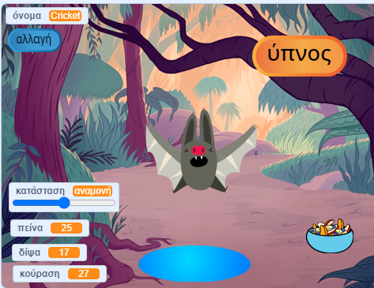
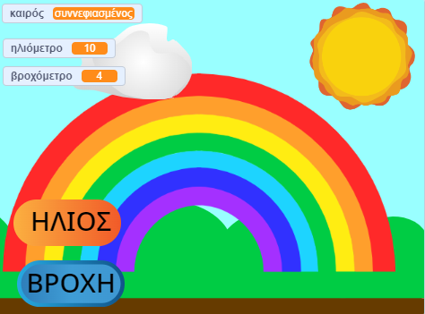

## Θα φτιάξεις

Δημιούργησε ένα εικονικό κατοικίδιο, χαρακτήρα ή προσομοίωση φύσης με το οποίο ο χρήστης μπορεί να αλληλεπιδράσει για να το βοηθήσει. Το παιχνίδι σου θα πρέπει να πληροί τη **σύνοψη έργου**.

Τα παιχνίδια με εικονικά κατοικίδια είναι ένας τύπος παιχνιδιού όπου οι χρήστες αλληλεπιδρούν με χαρακτήρες για να καλύψουν τις ανάγκες των χαρακτήρων. Μπορεί να έχεις παίξει με ένα μικρό φορητό Tamagotchi ή να έχεις απολαύσει παιχνίδια όπως το Catz και το Adopt me! σε έναν υπολογιστή. Μπορείς να σκεφτείς άλλα παιχνίδια με εικονικά κατοικίδια;

Θα χρειαστεί να:
+ Δημιουργήσεις έναν χαρακτήρα ή μια προσομοίωση που είναι διασκεδαστική ή ενδιαφέρουσα για αλληλεπίδραση
+ Χρησιμοποιήσεις οποιονδήποτε συνδυασμό `μεταβλητών`{:class="block3variables"}, `μεταδώσεων`{:class="block3events"} και μπλοκ `if` {:class="block3control"}, με τις δεξιότητες που έχεις ήδη μάθει, για να επιτρέψεις σε έναν χρήστη να καλύψει τις ανάγκες ενός χαρακτήρα
+ Κατανόησε πώς οι χαρακτήρες σε παιχνίδια και εφαρμογές ελέγχονται από αλγόριθμους

--- no-print ---

### Play

Interact with Cricket the bat. Τι θα συμβεί αν κάνεις κλικ στα αντικείμενα φαγητού ή νερού; Πώς μπορείς να καταλάβεις εάν η νυχτερίδα πεινάει ή διψάει;

**Προσομοίωση νυχτερίδας**: [Δες μέσα](https://scratch.mit.edu/projects/890825327/editor){:target="_blank"}

  <iframe allowtransparency="true" width="485" height="402" src="https://scratch.mit.edu/projects/embed/530008968/?autostart=false" frameborder="0"></iframe>

--- /no-print ---

### ΣΥΝΟΨΗ ΕΡΓΟΥ: Βοήθησέ με να αναπτυχθώ

Πρέπει να δημιουργήσεις ένα εικονικό κατοικίδιο, φυτό ή άλλη προσομοίωση με την οποία ο χρήστης μπορεί να αλληλεπιδράσει για να καλύψει τις ανάγκες του. Θα χρησιμοποιήσεις **μεταβλητές** για να παρακολουθήσεις την πορεία του κύριου αντικειμένου σου. Μπορεί να είναι χαρούμενο, βαριεστημένο, διψασμένο ή νυσταγμένο. 

Η προσομοίωση σου θα πρέπει να:
+ χρησιμοποιεί τουλάχιστον μία 'μεταβλητή'{:class="block3variables"} για να παρακολουθείς τι χρειάζεται το βασικό αντικείμενο
+ έχει έναν τρόπο για να αλλάζουν αυτόματα οι μεταβλητές
+ δίνει στον χρήστη ένα τρόπο να βελτιώσει τις μεταβλητές για να δώσει στο βασικό αντικείμενο αυτό που χρειάζεται
+ χρησιμοποιήσει το μπλοκ `εάν`{:class="block3control"} για να ελέγξει πότε συμβαίνουν πράγματα
+ χρησιμοποιεί μπλοκ `μετάδωσε`{:class="block3events"} για επικοινωνία μεταξύ άλλων αντικειμένων και του βασικού αντικειμένου.

Η προσομοίωση σου θα μπορούσε:
+ να έχει ένα μήνυμα, όπως καλοσύνη ή διατήρηση της υγείας των καλλιεργειών
+ να ειδοποιεί τον χρήστη όταν τα επίπεδα είναι πολύ υψηλά ή χαμηλά
+ να επιτρέπει στον χρήστη να συνομιλήσει με το αντικείμενό του ή να αλλάξει το όνομά του

--- no-print ---

### Πάρε ιδέες 💭

⭐ Μοιράσου το ολοκληρωμένο έργο κινουμένων σχεδίων Αστεία Μάτια για να έχεις την ευκαιρία να προβληθεί εδώ.

Σκέψου τι θα επιλέξεις ως βασικό αντικείμενο. Θα μπορούσε να είναι ένα κατοικίδιο που φροντίζει ο χρήστης, ένα άτομο που ο χρήστης βοηθά στη λήψη καλών αποφάσεων, ένα φυτό ή μια καλλιέργεια που βοηθά ο χρήστης να αναπτυχθεί ή ένα αντικείμενο φύσης ή φαντασίας που χρειάζεται ο χρήστης για να δημιουργήσει τις κατάλληλες συνθήκες.

**Δημιούργησε ένα ουράνιο τόξο**: [Δες μέσα](https://scratch.mit.edu/projects/890825864/editor){:target="_blank"}

  <iframe allowtransparency="true" width="485" height="402" src="https://scratch.mit.edu/projects/embed/530034441/?autostart=false" frameborder="0"></iframe>

**Αγρότης καρπουζιών**: [Δες μέσα](https://scratch.mit.edu/projects/890826086/editor){:target="_blank"}

  <iframe allowtransparency="true" width="485" height="402" src="https://scratch.mit.edu/projects/embed/531858794/?autostart=false" frameborder="0"></iframe>

**Δημιούργησε ένα ουράνιο τόξο**: [Δες μέσα](https://scratch.mit.edu/projects/890825864/editor){:target="_blank"}

  <iframe allowtransparency="true" width="485" height="402" src="https://scratch.mit.edu/projects/embed/799871118/?autostart=false" frameborder="0"></iframe>

--- /no-print ---

--- print-only ---

### Πάρε ιδέες 💭

Σκέψου τι θα επιλέξεις ως βασικό αντικείμενο. Θα μπορούσε να είναι ένα κατοικίδιο που φροντίζει ο χρήστης, ένα άτομο που ο χρήστης βοηθά στη λήψη καλών αποφάσεων, ένα φυτό ή μια καλλιέργεια που βοηθά ο χρήστης να αναπτυχθεί ή ένα αντικείμενο φύσης ή φαντασίας που χρειάζεται ο χρήστης για να δημιουργήσει τις κατάλληλες συνθήκες.

**Δες μέσα** παραδείγματα έργων στο στούντιο Scratch 'This sprite needs you — Examples': https://scratch.mit.edu/studios/29683913/

  

--- /print-only ---

