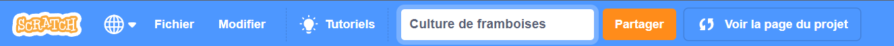

## Ton idée

Planifie ton animal de compagnie virtuel, ton personnage ou ta simulation de nature. L'utilisateur devra créer les bonnes conditions pour répondre aux besoins du sprite principal. Ton sprite principal peut grossir, acquérir de l'expérience, améliorer sa santé ou autre chose.

Tu peux planifier simplement en pensant, en bricolant, en dessinant ou en écrivant, ou comme bon te semble !

Lorsque les besoins de base comme la nourriture et la sécurité sont satisfaits, nous créons les bonnes conditions pour que les créatures (y compris nous-mêmes) apprennent et grandissent. Donc la prochaine fois que tu te sens grincheux ou distrait, vérifie tes besoins de base.  

### Pourquoi fais-tu ton projet ?

--- task ---

Pense au **but** de ton projet.

Ça pourrait être :
- Pour enseigner une nouvelle compétence, comme s'occuper d'un animal ou garder une plante en vie
- Pour partager un message, comme prendre soin de ta santé mentale ou améliorer ton quartier
- Pour divertir les utilisateurs, en leur donnant quelque chose avec lequel ils n'auraient généralement pas la chance d'interagir

--- /task ---

### C'est pour qui ?

--- task ---

Pense à **ton public**: pour qui fais-tu ton projet ?

Connaître ton public t'aideras à concevoir un projet que les utilisateurs voudront jouer encore et encore.

--- /task ---

### Commencer

--- task ---

Ouvre un [nouveau projet Scratch](http://rpf.io/scratch-new){:target="_blank"}. Scratch s'ouvrira dans un autre onglet du navigateur.

--- collapse ---
---
title: Travailler hors ligne
---

Pour configurer Scratch pour une utilisation hors ligne, consulte [notre guide Scratch](https://learning-admin.raspberrypi.org/en/projects/getting-started-scratch/1){:target="_blank"}.

--- /collapse ---

Utilise ton nouveau projet Scratch, un stylo et du papier, ou les deux pour planifier tes idées.

--- /task ---

--- task ---

Quel sera ton sprite **principal** ?
+ Un personnage tel qu'un animal domestique ou sauvage, ou une personne
+ Une plante ou une récolte qui a besoin de soleil, d'eau et de nutriments
+ Une caractéristique de la science ou de la nature, comme un arc-en-ciel ou un feu
+ Une machine, comme un sous-marin ou une machine de recyclage
+ Ou autre chose

--- /task ---

--- task ---

Pense à ton sprite **principal** et décide :

+ Quels objets et `variables`{:code="bloc::variables"} pourraient être nécessaires ?
+ Les `variables`{:code="bloc::variables"} changeront-elles avec le temps, par exemple la faim ou la fatigue augmentant toutes les quelques secondes ?
+ Comment l'utilisateur va-t-il interagir avec le sprite principal ? Il pourrait s'agir de cliquer sur de la nourriture pour nourrir un animal ou de discuter avec un personnage pour réduire son ennui.

--- /task ---

--- task ---

Donne à ton projet un titre qui indique à l'utilisateur à quoi s'attendre et qui lui donne envie de l'essayer.

Les exemples de projets étaient : **Simulateur de chauve-souris**, **Créer un arc-en-ciel**, **Cultivateur de pastèque** et ** La machine à musique**.

Tu peux toujours changer le titre plus tard si tu en trouves un meilleur.

--- /task ---

--- save ---
