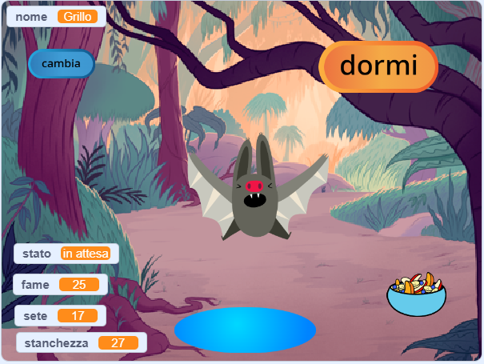
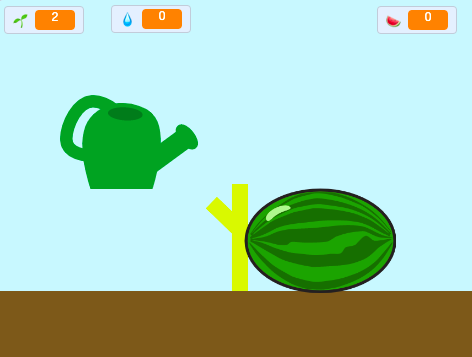
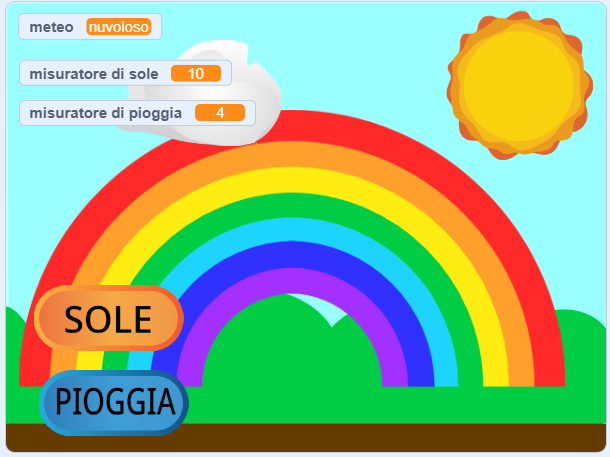

## Quello che farai

Crea un animale domestico virtuale, un personaggio o una simulazione della natura con cui l’utente possa interagire per prendersene cura. Il tuo gioco dovrà soddisfare i **requisiti del progetto**.

I giochi virtuali di animali domestici sono un tipo di gioco in cui gli utenti interagiscono con i personaggi per soddisfare i loro bisogni. Potresti aver giocato con un Tamagotchi portatile o con giochi come Catz e Adopt Me! su un computer. Ti vengono in mente altri giochi virtuali di animali domestici?

Cosa farai:
+ Creerai un personaggio o una simulazione divertente e coinvolgente con cui interagire
+ Userai in combinazione i blocchi `variabili`{:class="block3variables"}, `invia a tutti`{:class="block3events"} e `se`{:class="block3control"}, con le abilità che hai già acquisito, per permettere all’utente di soddisfare i bisogni di un personaggio
+ Comprenderai come i personaggi nei giochi e nelle app siano controllati da algoritmi

--- no-print ---

### Gioca

Interagisci con Cricket il pipistrello. Cosa succede se clicchi sugli sprite del cibo o dell'acqua? Come fai a sapere se il pipistrello ha fame o sete?

**Simulatore di pipistrello**: [Guarda dentro](https://scratch.mit.edu/projects/530008968/editor){:target="_blank"}

  <iframe allowtransparency="true" width="485" height="402" src="https://scratch.mit.edu/projects/embed/530008968/?autostart=false" frameborder="0"></iframe>

--- /no-print ---

### SCHEDA DEL PROGETTO: Aiutami a crescere

Devi creare un animale domestico virtuale, una pianta o un'altra simulazione con cui l'utente possa interagire per soddisfarne i bisogni. Utilizzerai **variabili** per monitorare del comportamento del tuo sprite principale. Potrebbe essere felice, annoiato, assetato o assonnato. 

La tua simulazione dovrà:
+ Usare almeno una `variabile`{:class="block3variables"} per monitorare i bisogni dello sprite principale
+ Avere un modo per far cambiare automaticamente la/le variabile/i
+ Dare all'utente un modo per migliorare le variabili e soddisfare i bisogni dello sprite principale
+ Usare blocchi `se`{:class="block3control"} per determinare quando eseguire determinate azioni
+ Usare blocchi `invia a tutti`{:class="block3events"} per comunicare tra gli sprite e lo sprite principale

La tua simulazione potrà:
+ Trasmettere un messaggio, come l'importanza della gentilezza o della coltivazione responsabile
+ Avvisare l'utente quando i livelli sono troppo alti o bassi
+ Permettere all'utente di chattare con il proprio sprite o di cambiarne il nome

--- no-print ---

### Lasciati ispirare 💭

⭐ Condividi il tuo progetto "Questo sprite ha bisogno di te" e potresti vederlo in primo piano qui.

Pensa a quale sprite scegliere come personaggio principale. Potrebbe essere un animale domestico di cui l’utente si prende cura, una persona da aiutare a fare scelte giuste, una pianta o una coltura da far crescere, oppure qualcosa di naturale o fantastico per cui creare le condizioni perfette.

**Crea un arcobaleno**: [Guarda dentro](https://scratch.mit.edu/projects/530034441/editor){:target="_blank"}

  <iframe allowtransparency="true" width="485" height="402" src="https://scratch.mit.edu/projects/embed/530034441/?autostart=false" frameborder="0"></iframe>

**Coltivatore di angurie**: [Guarda dentro](https://scratch.mit.edu/projects/531858794/editor){:target="_blank"}

  <iframe allowtransparency="true" width="485" height="402" src="https://scratch.mit.edu/projects/embed/531858794/?autostart=false" frameborder="0"></iframe>

**⭐ Dolly la bambola**: [Guarda dentro](https://scratch.mit.edu/projects/799871118/editor){:target="_blank"} (un progetto speciale della community)

  <iframe allowtransparency="true" width="485" height="402" src="https://scratch.mit.edu/projects/embed/799871118/?autostart=false" frameborder="0"></iframe>

--- /no-print ---

--- print-only ---

### Lasciati ispirare 💭

Pensa a quale sprite scegliere come personaggio principale. Potrebbe essere un animale domestico di cui l’utente si prende cura, una persona da aiutare a fare scelte giuste, una pianta o una coltura da far crescere, oppure qualcosa di naturale o fantastico per cui creare le condizioni perfette.

** Guarda i progetti** di esempio di "Questo sprite ha bisogno di te" in Scratch: https://scratch.mit.edu/studios/29683913/

  

--- /print-only ---

