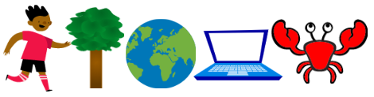

## La tua idea

Progetta un animale domestico virtuale, un personaggio o una simulazione della natura. L’utente dovrà creare le condizioni ideali per soddisfare i bisogni dello sprite principale. Lo sprite può crescere, acquisire esperienza, migliorare la propria salute o sviluppare altre caratteristiche.

Puoi progettare nel modo che preferisci: riflettendo, sperimentando, disegnando o scrivendo, in qualsiasi modo preferisci!

### Perché stai realizzando il tuo progetto?

--- task ---

Pensa allo **scopo** del tuo progetto.

Può servire a:
- Insegnare una nuova abilità, come prendersi cura di un animale o mantenere in vita una pianta
- Trasmettere un messaggio, ad esempio l'importanza di prendersi cura della propria salute mentale o migliorare il proprio quartiere
- Intrattenere gli utenti, offrendo loro qualcosa con cui normalmente non avrebbero l’opportunità di interagire

--- /task ---

### Per chi è?

--- task ---

Pensa a chi è rivolto il tuo progetto (il tuo **pubblico**).

Conoscere il tuo pubblico ti aiuterà a creare un progetto a cui vorranno sempre giocare.

--- /task ---

### Per cominciare

--- task ---

Apri un [nuovo progetto Scratch](http://rpf.io/scratch-new){:target="_blank"}. Scratch si aprirà in una nuova scheda del browser.

--- collapse ---
---
title: Lavorare offline
---

Per configurare Scratch per l'utilizzo offline, visita [la nostra guida a Scratch](https://projects.raspberrypi.org/it-IT/projects/getting-started-scratch/1){:target="_blank"}.

--- /collapse ---

Usa il tuo nuovo progetto in Scratch, carta e penna, o entrambi per pianificare le tue idee.

--- /task ---

--- task ---

Quale sarà il tuo sprite **principale**?
+ Un personaggio come un animale domestico o selvatico, o una persona
+ Una pianta o un raccolto che ha bisogno di luce solare, acqua e sostanze nutritive
+ Un elemento della scienza o della natura, come un arcobaleno o il fuoco
+ Una macchina, come un sottomarino o una macchina per il riciclaggio
+ O qualcos'altro

--- /task ---

--- task ---

Pensa al tuo sprite **principale** e decidi:

+ Quali oggetti e `variabili`{:class="block3variables"} potrebbero essere necessari?
+ Le `variabili`{:class="block3variables"} cambieranno nel tempo? Ad esempio, la fame o la stanchezza potrebbero aumentare con il passare dei secondi?
+ Come interagirà l’utente con lo sprite principale? Ad esempio, potrebbe cliccare sul cibo per nutrire un animale o interagire con un personaggio per alleviarne la noia.

--- /task ---

--- task ---

Dai al tuo progetto un titolo che faccia capire agli utenti cosa aspettarsi e li invogli a provarlo.

I progetti di esempio erano: **Simulatore di pipistrelli**, **Crea un arcobaleno**, **Coltivatore di angurie** e **Macchina musicale**.

Puoi sempre aggiornare il titolo in un secondo momento, se trovi un’idea migliore.

--- /task ---

--- save ---
