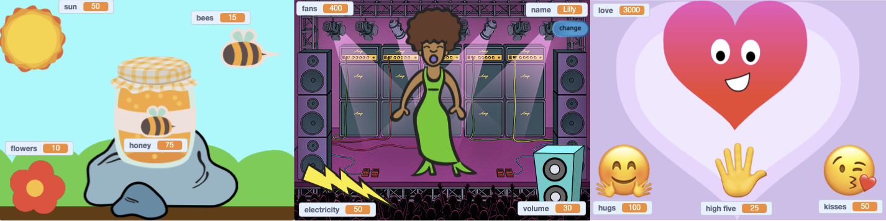

## Costruisci e prova

Ora è il momento di realizzare il tuo progetto. Inizia con calma e arricchisci il tuo progetto se hai più tempo.



**Suggerimento:** Ricordati di provare il tuo progetto ogni volta che aggiungi qualcosa. È molto più semplice trovare e correggere i bug prima di fare ulteriori modifiche.

--- task ---

Dovrai decidere in quale ordine realizzare il progetto. Potrai:

+ Creare una variabile e consentire all'utente di controllarla. Aggiungere animazioni, costumi, suoni, effetti speciali e dialoghi per dare vita al tuo sprite
+ Creare più variabili e permettere all'utente di controllarle in modo semplice, e in seguito aggiungere altri effetti

Aggiungere uno sprite e poi creare una `variabile`{:class=“block3variables”} è un ottimo inizio.

--- /task ---

Hai acquisito alcune abilità davvero utili. Ecco un promemoria per aiutarti a realizzare il tuo progetto:

### Utilizzo delle variabili

```blocks3
set [my variable v] to (0)
```

[[[scratch3-create-set-variable]]]

[[[scratch3-set-variable-with-button]]]

[[[scratch3-change-variable-in-loop]]]

### Verifica delle condizioni

```blocks3
if <(my variable) = (0)> then
```

[[[scratch3-forever-condition]]]

[[[scratch3-operators-conditions]]]

[[[scratch3-if-then-else]]]

[[[scratch3-set-block-input-colour-with-eyedropper]]]

### Trasmissione e ricezione di messaggi

```blocks3
broadcast (message1 v)
```

[[[generic-scratch3-broadcast-message]]]

### Utilizzare del testo:

```blocks3
say (join[Hello ](name)) for (2) seconds
```

[[[scratch3-emoji-text]]]

[[[scratch3-ask-answer-chat]]]

[[[scratch3-join-text]]]

### Sfondi, movimento ed effetti grafici

```blocks3
set [ghost v] effect to (0)
```

[[[scratch3-glide-to-object]]]

[[[scratch3-changing-backdrops-pages-levels]]]

[[[scratch3-change-costumes-to-show-mood]]]

[[[scratch3-animate-movement-costumes]]]

[[[scratch3-graphic-effects]]]

[[[scratch3-show-hide-sprites-backdrops]]]

[[[scratch3-positioning-with-layers]]]

[[[scratch3-jiggle-a-sprite]]]

### Suoni:

```blocks3
start sound (Pop v)
```

[[[scratch3-add-sound]]]

[[[scratch3-record-sound]]]

[[[scratch3-text-to-speech]]]

### Editor Paint: sfondi e costumi

[[[scratch3-paint-a-new-backdrop-extended]]]

[[[scratch3-backdrops-and-sprites-using-shapes]]]

[[[scratch3-use-text-tool]]]

[[[scratch3-copy-parts-between-sprite-costumes]]]

[[[scratch3-add-costumes-to-a-sprite]]]

### Editor di Scratch

[[[scratch3-copy-code]]]

[[[scratch3-full-screen]]]

[[[scratch3-duplicate-sprite]]]

[[[scratch-backpack]]]


--- task ---

**Test:** Mostra il tuo progetto agli altri e ascolta il loro parere. Vuoi fare qualche modifica al tuo gioco?

--- /task ---

--- task ---

**Debug:** Potresti trovare alcuni bug nel tuo progetto, che dovrai correggere. Ecco alcuni bug comuni.


--- collapse ---

---
title: Le variabili non si aggiornano correttamente
---

Un errore comune è quello di confondere i blocchi `cambia`{:class=“block3variables”} e `imposta`{:class=“block3variables”}.

+ `imposta`{:class="block3variables"} sostituisce il valore di una variabile con un nuovo valore.
+ `cambia`{:class="block3variables"} aggiunge un numero a una variabile. Se utilizzi il blocco `cambia di`{:class=“block3variables”} con un numero positivo, il valore della variabile diventa aumenta. Se utilizzi il blocco `cambia di`{:class=“block3variables”} con un numero negativo, il valore della variabile diventa diminuisce.


Un altro problema comune è quello di digitare il nome di una variabile invece di trascinarla dal menu dei blocchi `Variabili`{:class=“block3variables”}. Le variabili sono in arancione:

```blocks3
say (name) for (2) seconds
```

**non**:

```blocks3
say [name] for (2) seconds
```

--- /collapse ---

--- collapse ---

---
title: Un cambiamento si verifica una sola volta anziché ripetersi continuamente
---

Assicurati di inserire i blocchi di codice che devono essere eseguiti continuamente all'interno di un blocco `per sempre`{:class="block3control"}. È facile dimenticarsene.

--- /collapse ---

--- collapse ---

---
title: Le condizioni per confrontare i numeri non funzionano
---

Hai verificato di aver usato gli operatori `>`{:class=“block3operators”} (maggiore di) e `<`{:class=“block3operators”} (minore di) nel modo giusto?

```blocks3
<(health) > (0)> // means the health variable must be bigger than 0
<(health) < (5)> // means the health variable must be smaller than 5
```

**Suggerimento:** Il numero maggiore va posizionato sul lato più ampio (più grande) del simbolo dell'operatore.

--- /collapse ---

--- collapse ---

---
title: Non succede niente quando invio un messaggio
---

Assicurati di avere un blocco corrispondente `Quando ricevo`{:class="block3events"} che esegua un'azione quando utilizzi `Invia a tutti`{:class="block3events"} per inviare un messaggio. Verifica che i nomi dei messaggi corrispondano.

--- /collapse ---

Potresti trovare un bug non elencato qui. Sai come risolverlo?

Se ti blocchi, prova a leggere il tuo codice ad alta voce o a spiegare il problema a un amico o un'amica. Potresti individuare il problema.

Ci interessa sapere quali bug hai riscontrato e come li hai risolti. Utilizza il pulsante di feedback in fondo a questa pagina, se hai trovato un bug diverso nel tuo progetto.

--- /task ---


--- save ---

