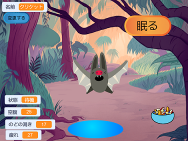
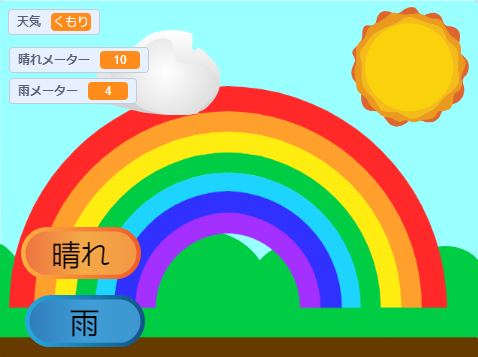

## はじめに

あなたが触れ合って助けてあげることができる仮想のペット、キャラクター、自然のシミュレーションを作りましょう あなたのゲームは**プロジェクト概要**の内容に沿っている必要があります。

バーチャル ペット ゲーム は、ユーザーがキャラクターと対話してキャラクターが求めているものを満たすゲームの一種です。 たまごっちで遊んだり、コンピュータでCatz や Adopt me などのゲームを楽しんだことがあるかもしれません。   他のバーチャル ペット ゲームを思いつきますか?

あなたは次のことを行います。
+ 交流するのが楽しいキャラクターやシミュレーションを作成する
+ すでに学習したスキルを使用して、 `変数`{:class="block3variables"}、 `ブロードキャスト`{:class="block3events"}、および `if`{:class="block3control"} ブロックを任意に組み合わせて使用する。ユーザーがキャラクターの求めているものを満たすことができるようにする
+ ゲームやアプリのキャラクターがアルゴリズムによってどのように制御されるかを理解する

--- no-print --- --- task ---

### 遊ぶ ▶️ 

コウモリのクリケットと交流します。 食べ物や水のスプライトをクリックするとどうなりますか? コウモリが空腹か喉が渇いているかをどうやって見分けることができますか?

**コウモリ シミュレーター**: [中を見る](https://scratch.mit.edu/projects/883430947/editor){:target="_blank"}

  <iframe allowtransparency="true" width="485" height="402" src="https://scratch.mit.edu/projects/embed/530008968/?autostart=false" frameborder="0"></iframe>

--- /task ---

--- /no-print ---

### プロジェクトの概要: 成長の手助けをしよう

ユーザーがニーズを満たすために触れ合うことができるバーチャルのペット、植物、またはその他のシミュレーションを作成する必要があります。 **変数**を使用して、メインのスプライトの動作を追跡します。 幸せ、退屈、のどが渇いている、または眠いかもしれません。 

シミュレーションがすべきこと:
+ 少なくとも 1 つの `variable`{:class="block3variables"} を使用して、メイン スプライトが必要とするものを追跡する
+ 変数が自動的に変わる方法を用意する
+ メイン スプライトに必要なものを与える変数を改良する方法をユーザーに与える
+ `if`{:class="block3control"} ブロックを使用して、いつ発生するかを制御する
+ `broadcast`{:class="block3events"} ブロックを使用して他のスプライトとメイン スプライトのコミュニケーションをする

シミュレーションができること:
+ 親切や作物を良好に保つなどのメッセージを表示する
+ レベルが高すぎるか低すぎる場合にユーザーに警告する
+ ユーザーがスプライトとチャットしたり、名前を変更できる

--- no-print ---

### アイデアを得る 💭

--- task ---

⭐ Share your finished This sprite needs you project for a chance of it being featured here.

メイン スプライトとして何を選ぶかを考えます。 ユーザーが世話をするペットや、ユーザーが良い判断をするよう手助けする人間、ユーザーが育てる植物や作物、またはユーザーが適切な環境を作る必要がある自然または空想のオブジェクトなどです。

**虹をかける**: [中を見る](https://scratch.mit.edu/projects/883431361/editor){:target="_blank"}

  <iframe allowtransparency="true" width="485" height="402" src="https://scratch.mit.edu/projects/embed/530034441/?autostart=false" frameborder="0"></iframe>

**スイカ農家**: [中を見る](https://scratch.mit.edu/projects/883431590/editor){:target="_blank"}

  <iframe allowtransparency="true" width="485" height="402" src="https://scratch.mit.edu/projects/embed/531858794/?autostart=false" frameborder="0"></iframe>

**⭐ お人形遊び**: [中を見る](https://scratch.mit.edu/projects/799871118/editor){:target="_blank"} (コミュニティプロジェクト)

  <iframe allowtransparency="true" width="485" height="402" src="https://scratch.mit.edu/projects/embed/799871118/?autostart=false" frameborder="0"></iframe>

--- /task ---

--- /no-print ---

--- print-only ---

### アイデアを得る 💭

メイン スプライトとして何を選ぶかを考えます。 ユーザーが世話をするペットや、ユーザーが良い判断をするよう手助けする人間、ユーザーが育てる植物や作物、またはユーザーが適切な環境を作る必要がある自然または空想のオブジェクトなどです。

**中を見る** 「このスプライトにはあなたが必要だ」のサンプルプロジェクト — スクラッチスタジオのサンプルはこちら: https://scratch.mit.edu/studios/29683913/

  

--- /print-only ---

