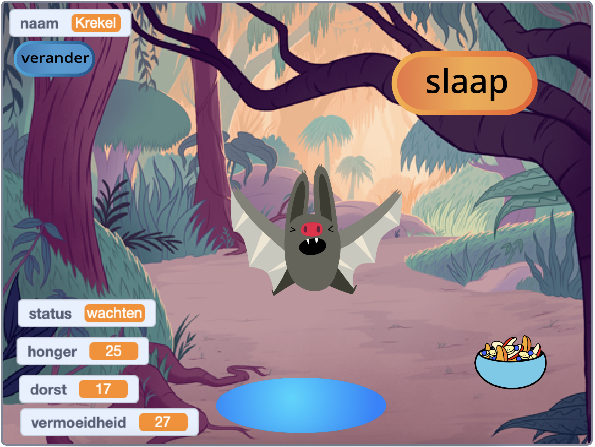
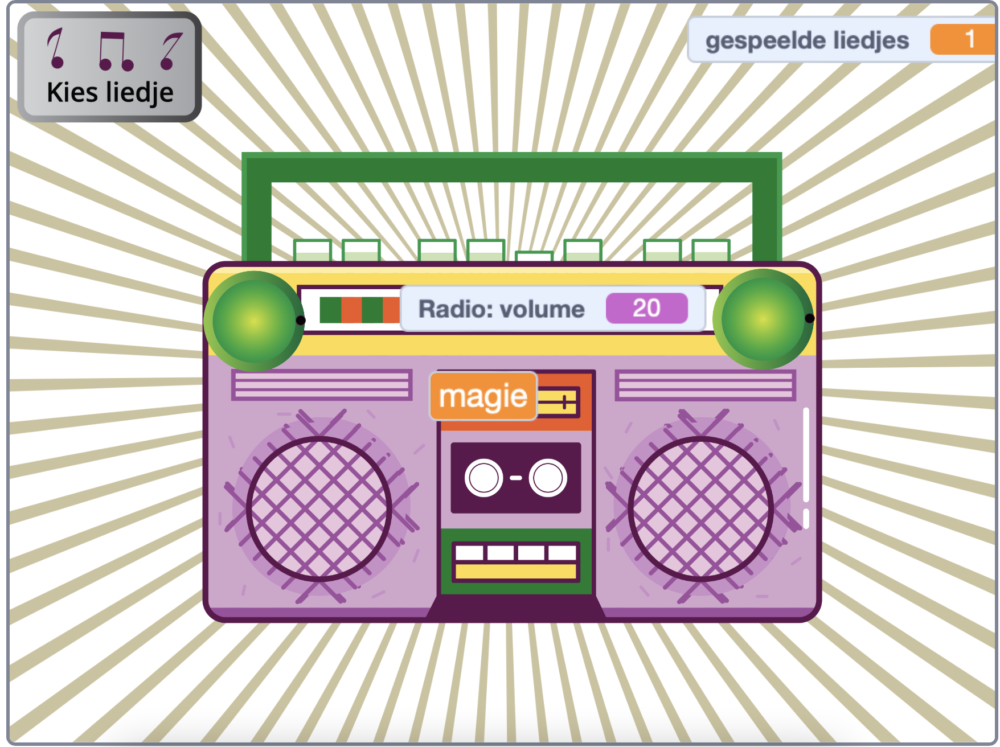
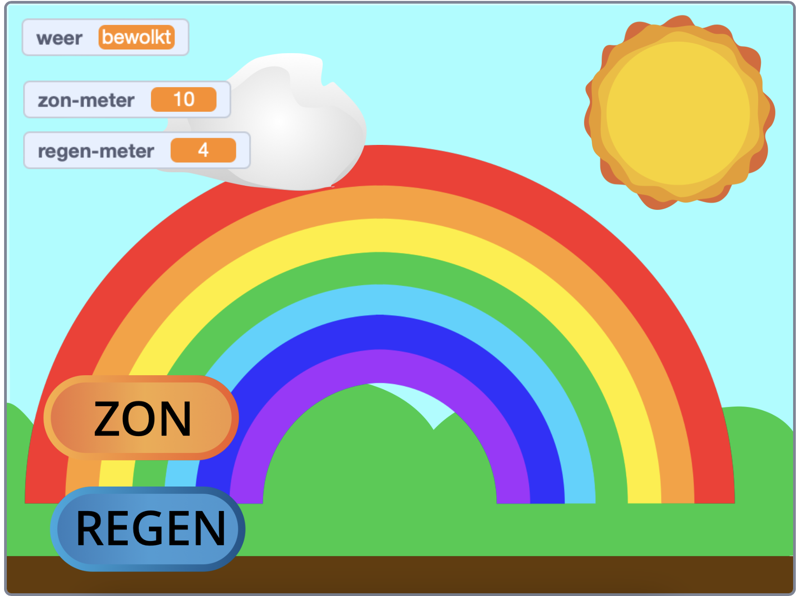

## Inleiding

Maak een virtueel huisdier, personage of natuursimulatie waarmee de gebruiker kan communiceren om het te helpen. Je spel moet voldoen aan de **projectsamenvatting**.

Virtuele gezelschapsspelen zijn een soort spel waarbij gebruikers met personages communiceren om aan de behoeften van de personages te voldoen. Je hebt misschien met een kleine Tamagotchi gespeeld of games zoals Catz of Adopt me! gespeeld op een computer. Ken je misschien nog andere virtuele huisdier spelletjes?

Je gaat:
+ Een personage of simulatie maken die leuk of interessant is om mee te communiceren
+ Elke combinatie van `variabelen`{:class="block3variables"}, `berichten`{:class="block3events"} en `als`{:class="block3control"} blokken gebruiken, met de vaardigheden die je al hebt geleerd, om een gebruiker in staat te stellen aan de behoeften van een personage te voldoen
+ Begrijpen hoe personages in games en apps worden bestuurd door algoritmen

--- no-print ---
--- task ---

### Probeer het

Communiceren met Cricket de vleermuis. Wat gebeurt er als je op de voedsel- of watersprites klikt? Hoe kun je zien of de vleermuis hongerig of dorstig is?

**Vleermuis simulator**: [Zie binnenkant](https://scratch.mit.edu/projects/723159607/editor){:target="_blank"}

  <iframe allowtransparency="true" width="485" height="402" src="https://scratch.mit.edu/projects/embed/723159607/?autostart=false" frameborder="0"></iframe>

--- /task ---

--- /no-print ---

### PROJECTSAMENVATTING: Help me groeien

Je moet een virtueel huisdier, plant of andere simulatie maken waarmee de gebruiker kan communiceren om aan zijn behoeften te voldoen. Je gebruikt **variabelen** om bij te houden hoe het met je belangrijkste sprite gaat. Je sprite kan gelukkig, verveeld, dorstig of slaperig zijn. 

Je simulatie moet:
+ gebruik maken van ten minste één 'variabele'{:class="block3variables"} om bij te houden wat de belangrijkste sprite nodig heeft
+ een manier hebben om de variabele(n) automatisch te laten veranderen
+ de gebruiker een manier geven om de variabelen te verbeteren om de belangrijkste sprite te geven wat het nodig heeft
+ gebruik 'als'{:class="block3control"} blokken om te regelen wanneer dingen gebeuren
+ gebruik blokken 'zend signaal'{:class="block3events"} om te communiceren tussen andere sprites en de belangrijkste sprite

Je simulatie zou:
+ een bericht kunnen hebben, zoals vriendelijkheid of het gezond houden van gewassen
+ de gebruiker kunnen waarschuwen wanneer de niveaus te hoog of te laag zijn + de gebruiker met zijn sprite kunnen laten chatten of zijn naam veranderen

--- no-print ---

### Doe inspiratie op

--- task ---

Denk na over wat je als hoofdsprite gaat kiezen. Het kan een huisdier zijn dat de gebruiker verzorgt, een persoon die de gebruiker helpt goede beslissingen te nemen, een plant of gewas dat de gebruiker helpt te groeien, of een natuur- of fantasieobject waarvoor de gebruiker de juiste omstandigheden moet maken.

**Maak een regenboog**: [See Inside](https://scratch.mit.edu/projects/723159864/editor){:target="_blank"}

  <iframe allowtransparency="true" width="485" height="402" src="https://scratch.mit.edu/projects/embed/723159864/?autostart=false" frameborder="0"></iframe>

**Watermeloen boer**: [Bekijk van binnen](https://scratch.mit.edu/projects/723160026/editor){:target="_blank"}

  <iframe allowtransparency="true" width="485" height="402" src="https://scratch.mit.edu/projects/embed/723160026/?autostart=false" frameborder="0"></iframe>

**Muziekmachine**: [Bekijk van binnen](https://scratch.mit.edu/projects/723160151/editor){:target="_blank"}

  <iframe allowtransparency="true" width="485" height="402" src="https://scratch.mit.edu/projects/embed/723160151/?autostart=false" frameborder="0"></iframe>

--- /task ---

--- /no-print ---

--- print-only ---

Denk na over wat je als hoofdsprite gaat kiezen. Het kan een huisdier zijn dat de gebruiker verzorgt, een persoon die de gebruiker helpt goede beslissingen te nemen, een plant of gewas dat de gebruiker helpt te groeien, of een natuur- of fantasieobject waarvoor de gebruiker de juiste omstandigheden moet maken.

**Bekijk van binnen** voorbeeldprojecten in de 'deze sprite heeft je nodig — voorbeelden' Scratch studio: https://scratch.mit.edu/studios/29683913/

   

--- /print-only ---

