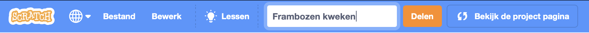

## Jouw idee

Plan je virtuele huisdier, personage of natuursimulatie. De gebruiker zal de juiste voorwaarden moeten maken om de behoeften van de hoofdsprite te ondersteunen. Je belangrijkste sprite zou groter kunnen worden, ervaring kunnen opdoen, de gezondheid kunnen verbeteren of iets anders.

Je kunt het plannen door erover na te denken, te knutselen, te tekenen of te schrijven, of hoe je maar wilt!

Wanneer aan basisbehoeften zoals voedsel en veiligheid wordt voldaan, creëren we de juiste omstandigheden voor wezens (inclusief onszelf) om te leren en te groeien. Dus de volgende keer dat je je humeurig of afgeleid voelt, controleer je basisbehoeften.  

### Waarom maak je je project?

--- task ---

Denk aan het **doel** van je project.

Dat kan zijn:
- Om een nieuwe vaardigheid te leren, zoals het verzorgen van een dier of het in leven houden van een plant
- Om een bericht te delen, zoals zorg dragen voor je geestelijke gezondheid of je buurt verbeteren
- Om gebruikers te entertainen, door ze iets te geven waar ze meestal niet de kans voor hebben om mee te communiceren

--- /task ---

### Voor wie is het?

--- task ---

Bedenk voor wie je je project gaat maken (je **publiek**).

Het kennen van je publiek zal je helpen een project te ontwerpen dat ze steeds opnieuw willen spelen.

--- /task ---

### Aan de slag

--- task ---

Open een [nieuw Scratch-project](http://rpf.io/scratch-new){:target="_blank"}. Scratch wordt in een nieuw browsertabblad geopend.

--- collapse ---
---
title: Offline werken
---

Om Scratch in te stellen voor offline gebruik, bezoek [onze Scratch-gids](https://learning-admin.raspberrypi.org/en/projects/getting-started-scratch/1){:target="_blank"}.

--- /collapse ---

Gebruik je nieuwe Scratch project, een pen en papier, of allebei om je ideeën te plannen.

--- /task ---

--- task ---

Wat zal je **hoofd** sprite zijn?
+ Een personage zoals een huisdier of wild dier, of een persoon
+ Een plant of gewas dat zonlicht, water en voedingsstoffen nodig heeft
+ Een kenmerk uit de wetenschap of de natuur, zoals een regenboog of een vuur
+ Een machine, zoals een onderzeeër of een recyclingmachine
+ Of iets anders

--- /task ---

--- task ---

Denk aan je **hoofd** sprite en besluit:

+ Welke objecten en `variabelen`{:class="block3variables"} zijn nodig?
+ Veranderen de `variabelen`{:class="block3variables"} in de loop der tijd, bijvoorbeeld om de paar seconden een toename van de honger of vermoeidheid?
+ Hoe zal de gebruiker met de hoofdsprite communiceren? Dit kan op voedsel klikken om een dier te voeden, of met een personage praten om hun verveling te verminderen.

--- /task ---

--- task ---

Geef je project een titel die de gebruiker vertelt wat hij kan verwachten en waardoor hij of zij het wil uitproberen.

De voorbeeldprojecten waren: **Vleermuissimulator**, **Maak een regenboog**, **Watermeloen boer**en **Muziekmachine**.

Je kunt de titel later altijd bijwerken als je een betere titel bedenkt.

--- /task ---

--- save ---
