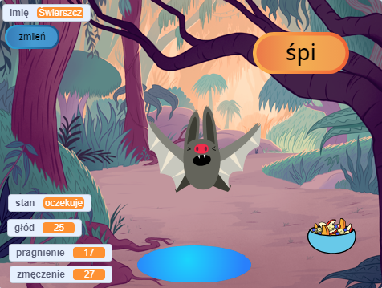
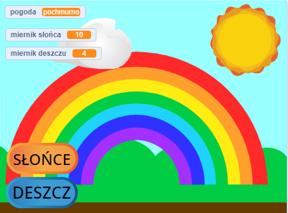

## Co będziesz robić

Stwórz wirtualnego zwierzaka lub postać, którym użytkownik może pomóc. Twoja gra musi spełnić **wymagania projektu**.

Wirtualne zwierzaki to typ gry, w której użytkownik reaguje na wymagania postaci. Mogłeś już grać w Tamagotchi lub adopcję wirtualnego psa lub kota!   Czy znasz inne tego typu gry?

Twoje zadanie:
+ Stwórz zabawną lub interesującą postać
+ Za pomocą dotychczas poznanych umiejętności użyj dowolnej kombinacji bloków `variables`{:class="block3variables"}, `broadcast`{:class="block3events"}, i `if`{:class="block3control"} aby pozwolić użytkownikowi na interakcję z postacią
+ Zrozumienie jak postacie w grach i aplikacjach są kontrolowane przez algorytmy

--- no-print --- --- task ---

### Odtwórz▶️ 
Wejdź w interakcję z nietoperzem. Co się dzieje, kiedy klikniesz na jedzenie lub wodę? Skąd wiesz czy nietoperz jest głodny lub spragniony?

**Bat simulator**: [See inside](https://scratch.mit.edu/projects/530008968/editor){:target="_blank"}

  <iframe allowtransparency="true" width="485" height="402" src="https://scratch.mit.edu/projects/embed/530008968/?autostart=false" frameborder="0"></iframe>

--- /task ---

--- /no-print ---

### WYMAGANIA PROJEKTU: Pomóż mi urosnąć

Stwórz wirtualnego zwierzaka, roślinę lub postać, z którą użytkownik może wejść w interakcję, aby spełnić jej wymagania. Użyjesz **variables** aby śledzić, jak się czuje Twój duszek. Może być szczęśliwy, znudzony, spragniony lub senny. 

Twoja symulacja powinna:
+ Używać co najmniej jednej `variable`{:class="block3variables"} aby śledzić czego potrzebuje główny duszek
+ Znaleźć sposób, aby zmienne same się zmieniały
+ Dać użytkownikowi możliwość ulepszenia zmiennych, aby dostarczyć duszkowi to, czego potrzebuje
+ Użyj bloków typu `if`{:class="block3control"}, aby kontrolować kiedy coś się wydarzy
+ Użyj bloków typu `broadcast`{:class="block3events"}, aby komunikować się pomiędzy duszkami

Twoja symulacja może:
+ Przekazywać wiadomość, taką jak życzenie powodzenia
+ Ostrzegać użytkownika kiedy poziomy są zbyt wysokie lub niskie
+ Pozwalać użytkownikowi rozmawiać z duszkiem lub zmieniać mu imię

--- no-print ---

### Znajdź pomysł

--- task ---

⭐ Share your finished This sprite needs you project for a chance of it being featured here.

Pomyśl, jaka będzie Twoja główna postać. Może to być zwierzak, którym trzeba się zaopiekować, osoba, której trzeba pomóc podjąć dobrą decyzję, lub roślina, której trzeba pomóc rosnąć.

**Make a rainbow**: [See inside](https://scratch.mit.edu/projects/530034441/editor){:target="_blank"}

  <iframe allowtransparency="true" width="485" height="402" src="https://scratch.mit.edu/projects/embed/530034441/?autostart=false" frameborder="0"></iframe>

**Watermelon farmer**: [See inside](https://scratch.mit.edu/projects/531858794/editor){:target="_blank"}

  <iframe allowtransparency="true" width="485" height="402" src="https://scratch.mit.edu/projects/embed/531858794/?autostart=false" frameborder="0"></iframe>

**⭐ Dolly the doll**: [See inside](https://scratch.mit.edu/projects/799871118/editor){:target="_blank"} (featured community project)

  <iframe allowtransparency="true" width="485" height="402" src="https://scratch.mit.edu/projects/embed/799871118/?autostart=false" frameborder="0"></iframe>

--- /task ---

--- /no-print ---

--- print-only ---

### Znajdź pomysł 💭

Pomyśl, jaka będzie Twoja główna postać. Może to być zwierzak, którym trzeba się zaopiekować, osoba, której trzeba pomóc podjąć dobrą decyzję, lub roślina, której trzeba pomóc rosnąć.

**Zobacz** przykładowe projekty w studio Scratcha 'Ten duszek Cię potrzebuje — przykłady': https://scratch.mit.edu/studios/29683913/

  

--- /print-only ---

