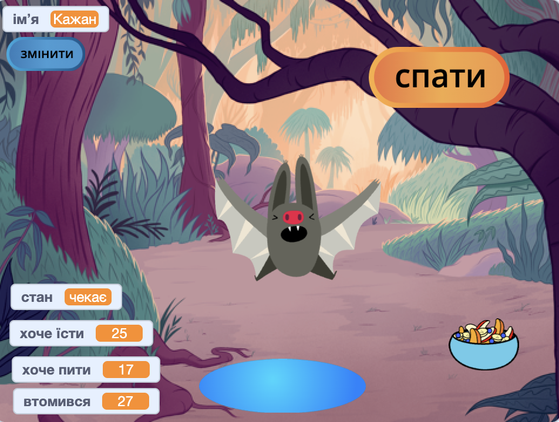
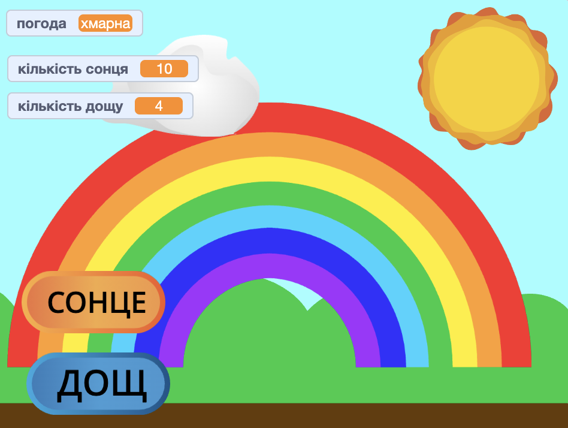

## Що ти зробиш

Створи віртуального улюбленця, персонажа або природне явище, з яким користувач може взаємодіяти та допомагати. Твоя гра повинна відповідати вимогам **короткого опису проєкту**.

Ігри з віртуальними улюбленцями — це тип ігор, де користувачі взаємодіють із персонажами, щоб виконати їхні потреби. Можливо, тобі зустрічались Тамагочі, або такі компʼютерні ігри, як Catz та Adopt me!  Ти знаєш ще якісь ігри з віртуальними улюбленцями?

У цьому проєкті ти:
+ Створиш персонажа або явище, з яким цікаво та весело взаємодіяти.
+ Використаєш поєднання блоків `змінних`{:class="block3variables"}, `оповіщення`{:class="block3events"} і `якщо`{:class="block3control"} і застосуєш отримані раніше навичками, щоб дозволити користувачу допомагати персонажу.
+ Зрозумієш, як алгоритми керують персонажами в іграх і застосунках.

--- no-print --- --- task ---

### Грати ▶️ 

Спробуй повзаємодіяти з кажаном. Що відбувається, коли ти натискаєш на спрайти їжі або води? Як можна зрозуміти, що кажан зголоднів або хоче пити?

**Симулятор кажана**: [Переглянути код](https://scratch.mit.edu/projects/530008968/editor){:target="_blank"}

  <iframe allowtransparency="true" width="485" height="402" src="https://scratch.mit.edu/projects/embed/530008968/?autostart=false" frameborder="0"></iframe>

--- /task ---

--- /no-print ---

### КОРОТКИЙ ОПИС ПРОЄКТУ: Допоможи мені вирости

Тобі потрібно створити віртуальну домашню тваринку, рослину або інший симулятор, якому користувач може допомагати. Ти будеш використовувати **змінні**, щоб відстежувати стан свого головного спрайта. Йому може бути добре або сумно, він може бути голодним або хотіти пити. 

Твоя гра має:
+ Використовувати щонайменше одну `змінну`{:class="block3variables"}, щоб відслідковувати стан головного спрайта.
+ Змінювати змінну (змінні) автоматично.
+ Давати користувачу можливість покращити значення змінної, щоб він міг давати головному спрайту те, що йому потрібно.
+ Використовувати блоки `якщо`{:class="block3control"}, щоб встановити, що за чим має відбуватися.
+ Використовувати блоки `оповістити`{:class="block3events"}, щоб головний спрайт обмінювався повідомленнями з іншими спрайтами.

Твоя гра може:
+ Мати головну ідею, наприклад, доброта або турбота за врожаєм.
+ Сповіщувати користувача, коли значення змінної зависоке або занизьке.
+ Дозволяти користувачу спілкуватися зі спрайтом або змінювати його імʼя.

--- no-print ---

### Отримай ідеї 💭

--- task ---

⭐ Поділися своїм готовим проєктом «Цей спрайт потребує тебе», і, можливо, ми опублікуємо його на цій сторінці.

Подумай, що ти зробиш своїм головним спрайтом. Це може бути хатня тваринка, про яку користувач піклується, людина, якій він допомагає приймати хороші рішення, рослина, якій користувач допомагає рости, або природне чи вигадане явище, для якого він має створити правильні умови.

**Створи веселку**: [Переглянути код](https://scratch.mit.edu/projects/530034441/editor){:target="_blank"}

  <iframe allowtransparency="true" width="485" height="402" src="https://scratch.mit.edu/projects/embed/530034441/?autostart=false" frameborder="0"></iframe>

**Кавуновий баштан**: [Переглянути код](https://scratch.mit.edu/projects/531858794/editor){:target="_blank"}

  <iframe allowtransparency="true" width="485" height="402" src="https://scratch.mit.edu/projects/embed/531858794/?autostart=false" frameborder="0"></iframe>

**⭐ Лялька Доллі**: [Переглянути код](https://scratch.mit.edu/projects/799871118/editor){:target="_blank"} (проєкт спільноти)

  <iframe allowtransparency="true" width="485" height="402" src="https://scratch.mit.edu/projects/embed/799871118/?autostart=false" frameborder="0"></iframe>

--- /task ---

--- /no-print ---

--- print-only ---

### Отримай ідеї 💭

Подумай, що ти зробиш своїм головним спрайтом. Це може бути хатня тваринка, про яку користувач піклується, людина, якій він допомагає приймати хороші рішення, рослина, якій користувач допомагає рости, або природне чи вигадане явище, для якого він має створити правильні умови.

**Переглянь код** проєктів-прикладів у студії Скретчу «Цей спрайт потребує тебе — приклади»: https://scratch.mit.edu/studios/29683913/

  

--- /print-only ---

