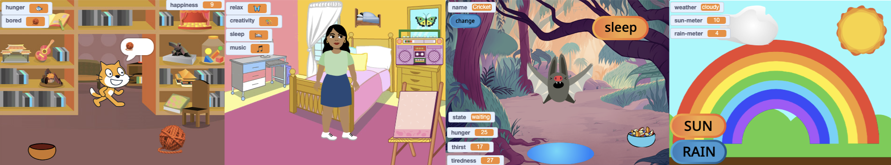

## Твоя ідея

Сплануй свого віртуального улюбленця, персонажа або природне явище. Користувачу потрібно буде створити правильні умови, щоб підтримувати існування головного спрайта. Можливо, твій головний спрайт ставатиме більшим, набувати досвіду, покращувати здоровʼя тощо.

Ти можеш планувати як завгодно — просто думаючи, майструючи, малюючи або пишучи!

Щоб істоти (включно з нами) мали потрібні умови для навчання й росту, їхні основні потреби (такі як їжа й безпека) повинні бути задоволені. Тому наступного разу, коли ти відчуватимеш роздратування або неуважність, перевір свої основні потреби.  

### Для чого ти робиш свій проєкт?

--- task ---

Подумай про **мету** свого проєкту.

Це може бути:
- Навчити нових навичок, наприклад, доглядати за твариною або рослиною.
- Заохотити до чогось, наприклад, подбати про своє психічне здоров’я чи покращити свою громаду.
- Розважити користувачів, даючи їм змогу взаємодіяти з чимось незвичайним.

--- /task ---

### Для кого твій проєкт?

--- task ---

Подумай, для кого ти будеш створювати свій проєкт (твоя **аудиторія**).

Knowing your audience will help you design a project they will want to play again and again.

--- /task ---

### Get started

--- task ---

Open a [new Scratch project](http://rpf.io/scratch-new){:target="_blank"}. Scratch will open in another browser tab.

--- collapse ---
---
title: Робота в режимі офлайн
---

To set up Scratch for offline use visit [our Scratch guide](https://learning-admin.raspberrypi.org/en/projects/getting-started-scratch/1){:target="_blank"}.

--- /collapse ---

Use your new Scratch project, a pen and paper, or both to plan your ideas.

--- /task ---

--- task ---

What will your **main** sprite be?
+ A character such as a pet or wild animal, or a person
+ A plant or crop that needs sunlight, water, and nutrients
+ A feature from science or nature, such as a rainbow or a fire
+ A machine, such as a submarine or a recycling machine
+ Or something else

--- /task ---

--- task ---

Think about your **main** sprite and decide:

+ What objects and `variables`{:class="block3variables"} might be needed?
+ Will the `variables`{:class="block3variables"} change over time, for example hunger or tiredness increasing every few seconds?
+ How will the user interact with the main sprite? This could be clicking on food to feed an animal, or chatting with a character to reduce their boredom.

--- /task ---

--- task ---

Give your project a title that tells the user what to expect, and makes them want to try it out.

The example projects were: **Bat simulator**, **Make a rainbow**, **Watermelon farmer**, and **Music Machine**.

You can always update the title later if you think of a better one.

--- /task ---

--- save ---
