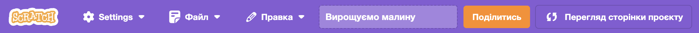

## Твоя ідея

Сплануй свого віртуального улюбленця, персонажа або природне явище. Користувачу потрібно буде створити правильні умови, щоб підтримувати існування головного спрайта. Можливо, твій головний спрайт ставатиме більшим, набувати досвіду, покращувати здоровʼя тощо.

Ти можеш планувати як завгодно — просто думаючи, майструючи, малюючи або пишучи!

Щоб істоти (включно з нами) мали потрібні умови для навчання й росту, їхні основні потреби (такі як їжа й безпека) повинні бути задоволені. Тому наступного разу, коли ти відчуватимеш роздратування або неуважність, перевір свої основні потреби.  

### Для чого ти робиш свій проєкт?

--- task ---

Подумай про **мету** свого проєкту.

Це може бути:
- Навчити нових навичок, наприклад, доглядати за твариною або рослиною.
- Заохотити до чогось, наприклад, подбати про своє психічне здоров’я чи покращити свою громаду.
- Розважити користувачів, даючи їм змогу взаємодіяти з чимось незвичайним.

--- /task ---

### Для кого твій проєкт?

--- task ---

Подумай, для кого ти будеш створювати свій проєкт (твоя **аудиторія**).

Знаючи свою аудиторію, ти зможеш розробити проєкт, з яким вони гратимуть знову й знову.

--- /task ---

### Початок роботи

--- task ---

Відкрий [стартовий проєкт у Скретчі](http://rpf.io/scratch-new){:target="_blank"}. Скретч відкриється у новій вкладці браузера.

--- collapse ---
---
title: Робота в режимі офлайн
---

Щоб налаштувати Скреч для використання офлайн, переглянь [наш путівник Скретчем](https://learning-admin.raspberrypi.org/en/projects/getting-started-scratch/1){:target="_blank"}.

--- /collapse ---

Використовуй свій стартовий проєкт у Скретчі або папір і ручку, щоб розпланувати свої ідеї.

--- /task ---

--- task ---

Що буде твоїм **головним** спрайтом?
+ Персонаж: хатня або дика тварина, людина.
+ Рослина, якій потрібно сонце, вода та поживні речовини.
+ Наукове або природне явище: веселка або вогонь.
+ Машина: підводний човен або машина для переробки сміття.
+ Щось інше.

--- /task ---

--- task ---

Подумай про свій **головний** спрайт і виріши:

+ Які об’єкти та `змінні`{:class="block3variables"} можуть тобі знадобитися?
+ Чи будуть `змінні`{:class="block3variables"} змінюватися з часом, наприклад, голод чи втома зростатимуть кожні кілька секунд?
+ Як користувач буде взаємодіяти з головним спрайтом? Користувач може натискати на їжу, щоб погодувати тварину, або спілкуватися з персонажем, щоб зменшити його нудьгу.

--- /task ---

--- task ---

Дай своєму проєкту назву, з якої користувач має зрозуміти, чого очікувати, і захотіти пограти.

Проєкти-приклади називалися **Симулятор кажана**, **Зроби веселку**, **Кавуновий баштан** і **Музична машина**.

Ти завжди можеш змінити назву пізніше, якщо придумаєш кращу.

--- /task ---

--- save ---
