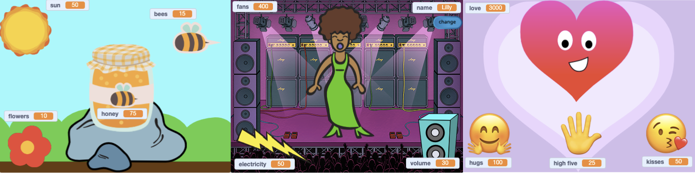

## Створи і протестуй

Настав час створити свій проєкт. Почни з чогось невеликого, а потім, якщо буде час, додай до свого проєкту більше елементів.



**Порада:** не забувай тестувати свій проєкт кожного разу, коли щось додаєш. Набагато простіше знайти та виправити помилки до того, як ти внесеш нові зміни.

--- task ---

Тобі потрібно обрати, у якому порядку ти створюватимеш свій проєкт. Ти можеш:

+ Створити одну змінну й дозволити користувачеві керувати нею. Додати анімації, образи, звуки, ефекти та розмови, щоб твій спрайт дійсно ожив.
+ Створити декілька змінних, якими користувач зможе легко керувати. Потім додати більше ефектів.

Хороший варіант — спочатку додати спрайт, а потім створити `змінну`{:class="block3variables"}.

--- /task ---

Ти здобув/-ла дуже корисні навички. Нагадай собі й вибери, що допоможе тобі реалізувати свій проєкт:

### Використання змінних

```blocks3
set [моя змінна v] to (0)
```

[[[scratch3-create-set-variable]]]

[[[scratch3-set-variable-with-button]]]

[[[scratch3-change-variable-in-loop]]]

### Перевірка умов

```blocks3
if <(моя змінна) = (0)> then
```

[[[scratch3-forever-condition]]]

[[[scratch3-operators-conditions]]]

[[[scratch3-if-then-else]]]

[[[scratch3-set-block-input-colour-with-eyedropper]]]

### Оповіщення та отримання повідомлень

```blocks3
broadcast (повідомлення1 v)
```

[[[generic-scratch3-broadcast-message]]]

### Робота з текстом:

```blocks3
say (join[Привіт ](імʼя)) for (2) seconds
```

[[[scratch3-emoji-text]]]

[[[scratch3-ask-answer-chat]]]

[[[scratch3-join-text]]]

### Тло, рух і графічні ефекти

```blocks3
set [привид v] effect to (0)
```

[[[scratch3-glide-to-object]]]

[[[scratch3-changing-backdrops-pages-levels]]]

[[[scratch3-change-costumes-to-show-mood]]]

[[[scratch3-animate-movement-costumes]]]

[[[scratch3-graphic-effects]]]

[[[scratch3-show-hide-sprites-backdrops]]]

[[[scratch3-positioning-with-layers]]]

[[[scratch3-jiggle-a-sprite]]]

### Звук:

```blocks3
start sound (Pop v)
```

[[[scratch3-add-sound]]]

[[[scratch3-record-sound]]]

[[[scratch3-text-to-speech]]]

### Редактор малювання — тло й образи

[[[scratch3-paint-a-new-backdrop-extended]]]

[[[scratch3-backdrops-and-sprites-using-shapes]]]

[[[scratch3-use-text-tool]]]

[[[scratch3-copy-parts-between-sprite-costumes]]]

[[[scratch3-add-costumes-to-a-sprite]]]

### Scratch editor

[[[scratch3-copy-code]]]

[[[scratch3-full-screen]]]

[[[scratch3-duplicate-sprite]]]

[[[scratch-backpack]]]


--- task ---

**Тест:** покажи комусь свій проєкт та отримай зворотний зв'язок. Хочеш внести якісь зміни до своєї гри?

--- /task ---

--- task ---

**Налагодження:** можливо, у твоєму проєкті знайдуться помилки, які потрібно буде виправити. Ось деякі поширені помилки.


--- collapse ---

---
title: Змінні не оновлюються належним чином
---

Однією з поширених помилок є плутання блоків `змінити`{:class="block3variables"} і `надати значення`{:class="block3variables"}.

+ `надати значення`{:class="block3variables"} замінює значення змінної новим значенням.
+ `змінити`{:class="block3variables"} додає число до змінної. Якщо ти `змінюєш`{:class="block3variables"} на додатне число, значення змінної збільшується. Якщо ти `змінюєш`{:class="block3variables"} на відʼємне число, значення змінної зміншується.


Ще одна поширена проблема — коли ти вводиш назву змінної замість того, щоб перетягнути її з меню блоків `Змінні`{:class="block3variables"}. Змінні мають бути помаранчевого кольору:

```blocks3
say (імʼя) for (2) seconds
```

**не**:

```blocks3
say [імʼя] for (2) seconds
```

--- /collapse ---

--- collapse ---

---
title: Зміна відбувається лише один раз, а не безкінечно
---

Переконайся, що твої блоки коду, які мають працювати безкінечно, розміщені всередині блоку `завжди`{:class="block3control"}. Багато людей забувають про це!

--- /collapse ---

--- collapse ---

---
title: Умови порівняння чисел не працюють
---

Ти точно використовуєш оператори `>`{:class="block3operators"} (більше ніж) і `<`{:class="block3operators"} (менше ніж) правильно?

```blocks3
<(здоровʼя) > (0)> // означає, що змінна «здоровʼя» має бути більшою за 0
<(здоровʼя) < (5)> // означає, що змінна «здоровʼя» має бути меншою за 5
```

**Підказка:** число, яке має бути більшим, розміщується на ширшій (більшій) стороні символу оператора.

--- /collapse ---

--- collapse ---

---
title: Коли я оповіщую за допомогою повідомлення, нічого не відбувається
---

Переконайся, що у тебе є відповідний блок `коли я отримую`{:class="block3events"}, який щось виконує, коли ти `оповіщуєш`{:class="block3events"} за допомогою повідомлення. Перевір, чи збігаються назви повідомлень.

--- /collapse ---

Ти можеш виявити помилку, яка не вказана тут. Можливо, ти зможеш придумати, як її виправити?

Якщо у тебе виникли складнощі, прочитай свій код вголос або опиши проблему подрузі чи другові. Можливо, ти помітиш помилку.

Нам подобається дізнаватись про твої помилки та про те, як їх вдалося виправити. Якщо ти знайшов/-ла іншу помилку у своєму проєкті, скористайся формою зворотного зв'язку внизу цієї сторінки.

--- /task ---


--- save ---

